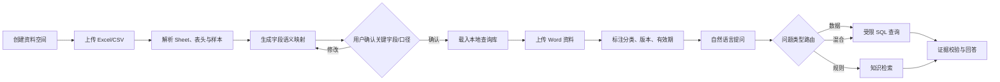

# 商家私有数据知识问答助手：技术方案（MVP）

> **已确认的实施口径（优先于本文中与之冲突的早期设想）**
>
> - 最终交付为可在 **WorkBuddy** 中运行的本机 Skill，不是云端 SaaS 功能。
> - Phase 1 直接支持**同一工作簿内跨 Sheet 识别与计算**；系统提出关联候选，用户确认关联键后才可联表。
> - Phase 1 **不使用数据库**。Excel/CSV 解析为本机内存表；字段映射、文档索引与审计记录保存为 Skill 工作目录内的 JSON/索引文件。
> - 对免费用户不设置平台侧的数据容量、文件数量或保留期限配额。资料留在用户电脑；超出本机承受能力时以解析/计算保护和拆分提示处理，而非容量收费墙。
> - 首个完整案例使用服装批发业务：款号、供应商、采购/进货、入库、销售、库存、批发报价。
> - 用户界面只需“提问 → 结果 → 必要依据（Sheet、字段、筛选/计算口径、命中数）”；不展示完整 Prompt、查询计划或 Agent 内部运行轨迹。

## 0. 实施基线（替代原先的云端与数据库设想）

```text
WorkBuddy 本机工作目录
├── 原始 Excel/CSV/Word 文件
├── workspace.json                 # 资料空间配置
├── field-mappings.json            # 字段语义和用户确认的跨 Sheet 关联
├── business-definitions.json      # 销售额、库存等业务口径
├── knowledge-index/               # Word 切片、关键词/可选向量索引
└── query-audits.jsonl             # 提问、计算摘要、证据和回答

用户问题
  → LLM 仅生成结构化意图/查询计划
  → 本机白名单执行器读取内存表、按已确认关系联表计算
  → 结果与资料来源校验
  → 返回自然语言结论与必要依据
```

### 0.1 本机执行边界

- 不运行任意模型 SQL 或脚本；模型输出只能是白名单字段、过滤、聚合、排序和已确认的关联关系。
- 本机执行器必须限制最大返回行数、最大关联规模、计算超时与内存占用；设备不足时停止并提示用户缩小 Sheet、时间范围或拆分文件。
- 发送给 DeepSeek 等模型的内容遵循最小化原则：优先发送字段名、语义映射、少量脱敏样例、用户问题和计算结果；不默认上传原始经营明细或 Word 原文。
- Skill 提供“删除本资料空间”入口，清除原始文件、解析缓存、知识索引和审计日志。

### 0.2 跨 Sheet 识别流程

1. 解析所有 Sheet 的表头、数据类型、样例和候选唯一值。
2. 识别可能的关联字段，例如 `采购明细.款号`、`入库明细.货号`、`销售明细.款号`。
3. 将候选关系及其匹配率展示给用户；用户确认后写入 `field-mappings.json`。
4. 只允许在已确认关系上执行关联、汇总和对比；关联缺失、重复率过高或匹配率过低时不给出确定结论。

服装批发案例的最小关系：

```text
商品档案（款号）
  ├── 采购/进货明细（款号、供应商、进货数量、进货单价、日期）
  ├── 入库明细（款号、入库数量、日期）
  ├── 销售明细（款号、销售数量、批发价、日期）
  └── 库存明细（款号、可售库存、更新时间）
```

首批验收问题：

1. “本周销量前十但可售库存低于 20 的款有哪些？”
2. “本月向各供应商进货的数量和金额分别是多少？”
3. “款号 A123 的进货、入库、销售和当前库存是否一致？不一致在哪个环节？”

## 1. 产品定义

面向商家、小团队和 AI 初学者的免费 Skill。用户上传自己的 Excel/CSV 业务表，以及 Word 等经营资料后，用自然语言查询数据、了解规则或获得带来源依据的综合回答。

它不是“让 AI 看一眼表格后随意聊天”，而是一套可复刻的 Agent 案例：

```text
上传资料 → 理解数据结构 → 人工确认业务语义 → 受限查询/检索 → 可追溯回答
```

核心价值：把散落在本地的经营数据和制度资料变成可问、可核验的私有知识入口；同时让小白用户看见一个 Agent 是怎样由“输入、规则、工具、输出、验收”构成的。

## 2. MVP 目标与非目标

### 2.1 MVP 要解决的问题

支持以下八类只读问题：

1. 商品与库存分析
2. 销售数据分析
3. 价格与报价报表
4. 客户与线索管理
5. 采购与供应商管理
6. 项目与任务管理
7. 运营与活动复盘
8. 行政与人事基础统计

统一能力边界为：**查、筛、算、排、比**。

### 2.2 MVP 明确不做

- 不修改用户原始表，不写回 Excel。
- 不执行宏、不计算复杂 Excel 公式、不解析图片型/扫描型表格。
- 不做预测、自动定价、自动补货、财税/薪酬/投资建议。
- 不直接发送邮件、消息或电商平台回复。
- 不支持复杂跨文件关联；同一工作簿内的关联也必须由用户确认。
- 不把检索到的 Word 内容伪装成精确数据结论。

## 3. 支持资料与输入限制

| 类型 | MVP 支持 | 限制 | 用途 |
|---|---|---|---|
| 结构化数据 | `.xlsx`、`.csv` | 单文件；最多 5 个 Sheet；每 Sheet 不超过 50,000 行、60 列；文件不超过 10 MB | 事实、金额、数量、日期、排名、统计 |
| 知识文档 | `.docx` | 单份不超过 20 MB；每商家初期不超过 50 份 | 政策、规则、流程、商品描述、定义 |
| 后续可选 | `.pdf`、`.txt`、`.md` | 不纳入 MVP 承诺 | 扩充知识库来源 |

拒绝或提示用户整理后再上传的情况：加密文件、VBA 宏、无表头的自由排版、合并单元格为主的报表、图片表格、单 Sheet 超限、无法稳定识别编码的 CSV。

## 4. 关键原则

### 4.1 数据与知识分层

| 层 | 权威来源 | 能回答什么 | 不应回答什么 |
|---|---|---|---|
| 数据层 | Excel/CSV | 库存、销量、金额、日期、记录数、排行、同比/环比（数据具备前提下） | 政策是否允许、业务口径未定义的结论 |
| 知识层 | 已生效 Word 文档 | 价格政策、售后规则、发货流程、商品说明、名词定义 | 当前库存、实时价格、精确金额 |

“资料更多”不等于“答案必然更准确”。准确性的前提是资料可读、版本有效、字段/规则已确认且与问题相关。

### 4.2 模型不直接计算事实

LLM 仅做四件事：

1. 理解用户问题；
2. 识别字段和业务口径；
3. 生成受限的查询计划；
4. 把工具返回的结果解释为自然语言。

所有筛选、求和、分组、排序、比较均由数据库执行。回答不能出现工具结果之外的数字。

### 4.3 每个答案必须可追溯

数值回答必须附带：使用的数据文件/Sheet、字段、筛选条件、计算定义、命中行数、上传时间及可展开的源记录。

知识回答必须附带：文档名、版本、有效状态、标题/段落位置及上传时间。

混合回答必须把“数据结果”和“规则依据”分开显示。

## 5. 用户流程



### 5.1 数据导入与确认

系统从 Excel 中识别 Sheet、表头、数据类型、空值率、去重率和样例值，生成“字段语义映射”。系统不得仅凭模型猜测就把字段作为金额、库存或唯一 ID 使用。

用户至少确认：

- 唯一标识字段（如订单号、款号、客户编号）；
- 日期字段；
- 金额、数量、库存等精确数值字段；
- 关键业务定义（例如“销售额是否含退款”“利润如何计算”）；
- 需要关联的 Sheet 及关联字段。

示例：

```json
{
  "datasetId": "apparel-stock-20260727",
  "sheet": "库存明细",
  "fields": [
    {"source": "款号", "semantic": "style_code", "type": "string", "aliases": ["货号", "编号"]},
    {"source": "可售库存", "semantic": "available_inventory", "type": "number", "aliases": ["库存", "现货"]},
    {"source": "批发价", "semantic": "wholesale_price", "type": "currency", "aliases": ["拿货价"]},
    {"source": "本周销量", "semantic": "weekly_sales", "type": "number", "aliases": ["周销量"]}
  ],
  "confirmedByUser": true
}
```

### 5.2 文档入库与版本管理

Word 以标题、段落和表格为最小可引用单元切分；每个切片保留原文、文档 ID、标题路径、页码/段落序号、版本、有效期和分类。

每份资料要求填写或由系统建议后确认：

```json
{
  "documentId": "pricing-policy-v3",
  "title": "客户分级报价政策",
  "category": "价格政策",
  "version": "v3.0",
  "status": "active",
  "effectiveFrom": "2026-07-01",
  "effectiveTo": null,
  "scope": "全体经销客户",
  "uploadedAt": "2026-07-27T10:00:00+08:00"
}
```

新版本不覆盖旧版本；旧版本置为 `expired` 或保留历史状态。若同一问题命中互相冲突的有效资料，系统必须标记冲突，不能自行选择其一。

## 6. 问题路由与回答规则

### 6.1 三类问题

| 用户问题 | 路由 | 处理方式 |
|---|---|---|
| “库存低于 20 的款有哪些？” | 数据问题 | 查询数据库，返回明细和统计 |
| “老客户享受什么折扣？” | 规则问题 | 检索已生效资料，引用原文位置 |
| “库存低于 20 的款，老客户报价按什么规则？” | 混合问题 | 先查库存，再检索价格政策，分区呈现 |

### 6.2 无法可靠回答时

- 所需字段未映射或未确认：要求用户确认字段，不能猜。
- 数据中没有命中记录：明确说明“当前上传数据中未找到”。
- 知识库没有来源：明确说明“当前资料中未找到”。
- 规则与数据冲突：显示冲突来源并要求确认。
- 问题超出范围：说明不能执行，例如“不能根据历史销量自动决定下月采购量”。

## 7. 技术架构

```text
前端（上传、字段确认、提问、证据展开）
        │
API / Agent Orchestrator
        ├── 文件安全与解析服务
        ├── Schema 服务（字段语义映射、口径、版本）
        ├── Query Planner（LLM）
        ├── SQL Guard + DuckDB/SQLite 执行器
        ├── Knowledge Index（Word 切分、向量/关键词检索）
        ├── Evidence Validator（数字、来源、冲突校验）
        └── Answer Composer（结构化结果转自然语言）
        │
对象存储（原始文件） + PostgreSQL（元数据/权限/审计） + 本地查询库/向量索引
```

### 7.1 建议组件职责

| 组件 | 职责 | 实现建议 |
|---|---|---|
| 文件解析 | 提取 Sheet、表头、值、Word 段落与表格 | ExcelJS/SheetJS；Mammoth 或 docx 解析器 |
| 结构化查询 | 导入行数据并执行只读聚合查询 | DuckDB 优先；SQLite 作为轻量备选 |
| 语义映射 | 保存原始字段、别名、类型和确认状态 | PostgreSQL JSONB + 显式版本 |
| 知识检索 | 文档切块、关键词/向量召回、过滤有效版本 | PostgreSQL + pgvector 或独立向量库 |
| LLM | 分类、字段匹配、查询计划、结果表达 | DeepSeek 等低成本模型；不得授权其直连数据库 |
| 审计 | 保存问题、计划、执行记录、来源与回答 | PostgreSQL 审计表 |

### 7.2 受限查询机制

不要执行模型直接输出的任意 SQL。采用“结构化查询计划 + 编译器”模式：

```json
{
  "datasetId": "apparel-stock-20260727",
  "intent": "rank",
  "filters": [{"field": "available_inventory", "operator": "<", "value": 20}],
  "metrics": [{"op": "count", "as": "style_count"}],
  "select": ["style_code", "available_inventory", "wholesale_price"],
  "orderBy": [{"field": "available_inventory", "direction": "asc"}],
  "limit": 100
}
```

服务端只接受白名单字段、操作符、聚合函数和行数上限，并从已确认的 schema 编译 SQL。数据库账号只读；单次查询设定超时和最大返回行数。

### 7.3 回答数据结构

```json
{
  "answerType": "mixed",
  "summary": "共有 12 个款的可售库存低于 20 件。老客户折扣需按《客户分级报价政策》v3.0 执行。",
  "dataEvidence": {
    "dataset": "库存明细",
    "fields": ["款号", "可售库存"],
    "filters": ["可售库存 < 20"],
    "matchedRows": 12,
    "uploadedAt": "2026-07-27T10:00:00+08:00"
  },
  "knowledgeEvidence": [{
    "document": "客户分级报价政策",
    "version": "v3.0",
    "status": "active",
    "location": "第二章 > 老客户折扣",
    "excerpt": "..."
  }],
  "warnings": []
}
```

## 8. 数据模型（最小集合）

```text
workspaces             商家资料空间与租户隔离
data_assets            上传的 Excel/CSV 文件元数据
data_sheets            Sheet 元数据和导入状态
field_mappings         原字段、语义字段、类型、别名、确认状态、版本
business_definitions   销售额/利润等口径定义
knowledge_documents    Word 文档、版本、状态、有效期、分类
knowledge_chunks       段落/标题/表格切片及检索向量
query_sessions         会话及当前引用的数据集版本
query_audits           用户问题、查询计划、执行状态、证据和最终回答
```

所有业务数据、文件、切片和查询记录必须带 `workspace_id`，所有查询先做租户过滤。原始文件与解析后的数据均需加密存储、访问鉴权和可删除机制。

## 9. 关键难点与处理方案

| 难点 | 风险 | 方案 |
|---|---|---|
| 表格字段五花八门 | 模型把“金额”“库存”等字段误判 | 自动建议 + 用户确认；未确认字段不得用于关键结论 |
| Excel 并非标准数据库 | 多表、公式、合并单元格会解析错误 | MVP 只接受二维明细表和已保存公式结果；复杂文件拒绝或引导整理 |
| LLM 幻觉与算错 | 产生无法核验的业务数字 | LLM 只生成计划；计算由 DuckDB/SQLite 执行；数字与证据校验 |
| 文档版本冲突 | 过期政策被当作当前规则 | 文档必须有版本、生效状态和有效期；冲突显式提示 |
| RAG 引用失真 | 答案看似有依据但来源不支持 | 每条规则回答必须带切片来源；无来源不回答 |
| 数据安全 | 商家资料泄露或跨租户访问 | workspace 隔离、对象存储私有桶、最小权限、审计、可删除 |
| 成本 | 免费引流产品调用成本失控 | 小模型处理分类/计划；本地 SQL；文档向量化按上传触发；缓存 schema 和常见问题 |

## 10. 与已有 Skill 的连接边界

现有“会议纪要行动助手”和“客户邮件助手”可以后续接入，但不应在 MVP 中自动化闭环。

```text
会议纪要 → 人工确认行动项 → 用户查询项目/库存/客户数据 → 引用证据
客户邮件 → 人工选择已验证的数据查询结果 → 生成回复草稿 → 人工确认发送
```

约束：邮件助手只能使用本助手已经返回且带证据的结果作为草稿事实，不得自行编造价格、库存、交期或政策；所有邮件仍保留人工确认发送。

## 11. MVP 开发拆分与验收

### Phase 1：结构化数据问答（首个可用版本）

- 上传 `.xlsx/.csv`，解析并预览；
- 生成字段映射，完成用户确认；
- 导入 DuckDB/SQLite；
- 支持查、筛、算、排、比；
- 每个回答展示证据；
- 记录审计日志。

验收标准：在准备好的 8 类样例表中，用户完成字段确认后，预设问题的答案可由源表复算；每个数值结论可定位到数据集、字段和筛选条件。

### Phase 2：Word 知识库

- 上传 `.docx`，提取标题、正文和表格；
- 分类、版本、有效期管理；
- 支持规则问答和来源引用；
- 支持数据+规则的混合问题；
- 支持冲突提示。

验收标准：规则问题只引用 `active` 文档；更换为过期版本后不会被默认引用；无来源和冲突场景均能明确提示。

### Phase 3：与两个已有 Skill 的人工确认式串联

- 将带证据的数据回答作为会议行动项和邮件草稿的可选上下文；
- 保留人工选择、确认和发送；
- 不新增第三方电商或 IM 平台依赖。

## 12. 引流与教学呈现

产品页面不只展示“问表格”，还应公开展示一次 Agent 的运行轨迹：

```text
用户问题 → 识别出的字段 → 查询计划 → 执行结果 → 证据来源 → 最终回答
```

新人先用平台准备的服装库存、销售和价格政策样例完成 3 个问题，再上传自己的表和 Word，查看同一套结构如何被复刻。这样免费工具本身完成引流，运行轨迹则承担 AI 入门教学。

## 13. 启动前决策

技术实现前需要固定以下产品口径：

1. Phase 1 是否只做单工作簿内的单 Sheet 查询，跨 Sheet 延至 Phase 2；
2. 初期是否只支持 `.docx`，PDF 延后；
3. 每个免费用户的数据容量、保留期限和删除策略；
4. 是否以服装批发样例作为首个演示模板，再逐步扩展八类场景；
5. 前端是否要完整展示查询计划，或只给“字段/筛选/计算口径”的易读版。

建议：首版选择“单 Sheet + `.xlsx/.csv` + 服装批发演示模板 + 易读证据卡片”。先验证用户是否愿意上传、确认字段并提出第二个问题，再扩展 Word 和多表能力。
